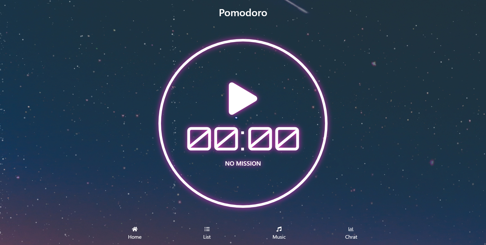

# 第一關 - 番茄鐘

## 使用技術
- [Vue CLI](https://cli.vuejs.org/)
- [BootstrapVue](https://bootstrap-vue.js.org/)
- [Particles.js](https://vincentgarreau.com/particles.js/)
- [Font Awesome](https://fontawesome.com/)
- [Loading.io](https://loading.io/)
- Progressive Web Application
- [Background photo by Diego PH on Unsplash](https://unsplash.com/photos/5LOhydOtTKU)

## 相關連結
[題目](https://challenge.thef2e.com/news/12)