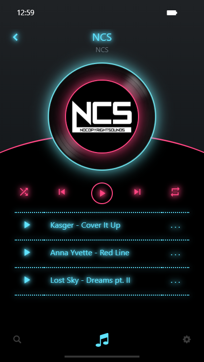

# 第三關 - MP3 Player
有些很重要的素材設計稿並沒有提供像是閃電效果和部分icon  
雖然沒做完，不過已經在這關花了兩天的時間，所以就先投稿，去忙別的事了  
   

## 使用技術
- [Vue CLI](https://cli.vuejs.org/)
- [BootstrapVue](https://bootstrap-vue.js.org/)
- [Vuex](https://vuex.vuejs.org/)
- Progressive Web Application

## 相關連結
- [題目](https://challenge.thef2e.com/news/14)
- [設計稿](https://challenge.thef2e.com/user/1966?schedule=3168#works-3168)
- [線上預覽](https://rogeraabbccdd.github.io/F2E-2019/stage3/#/)
