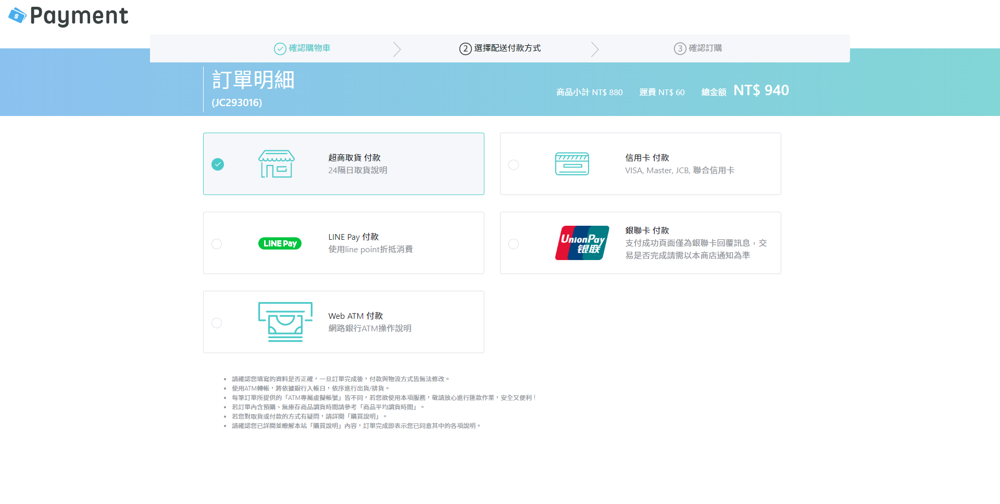

# 第四關 - 線上支付
這禮拜比較忙，只做第一頁，功能都沒做，也沒有RWD  
設計稿提供的SVG ICON文字沒有轉外框，字形跑掉了，所以有另外用illustrator處理過  
   

## 使用技術
- [Vue CLI](https://cli.vuejs.org/)
- [BootstrapVue](https://bootstrap-vue.js.org/)
- Progressive Web Application

## 相關連結
- [題目](https://challenge.thef2e.com/news/15)
- [設計稿](https://challenge.thef2e.com/user/2346?schedule=3480#works-3480)
- [線上預覽](https://rogeraabbccdd.github.io/F2E-2019/stage4/index.html)
