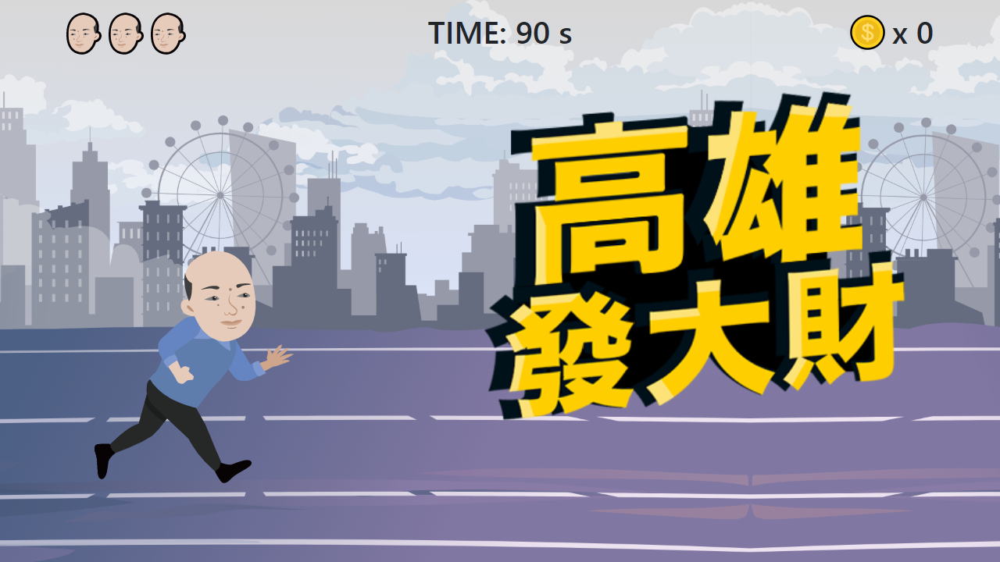

# 第五關 - 90 秒挑戰遊戲
這禮拜比較忙，只做首頁  
找不到設計稿內的文字字形，所以用 Bootstrap 預設字形
   

## 使用技術
- [Vue CLI](https://cli.vuejs.org/)
- [BootstrapVue](https://bootstrap-vue.js.org/)
- Progressive Web Application

## 相關連結
- [題目](https://challenge.thef2e.com/news/16)
- [設計稿](https://challenge.thef2e.com/user/1861?schedule=3696#works-3696)
- [線上預覽](https://rogeraabbccdd.github.io/F2E-2019/stage5/index.html)
